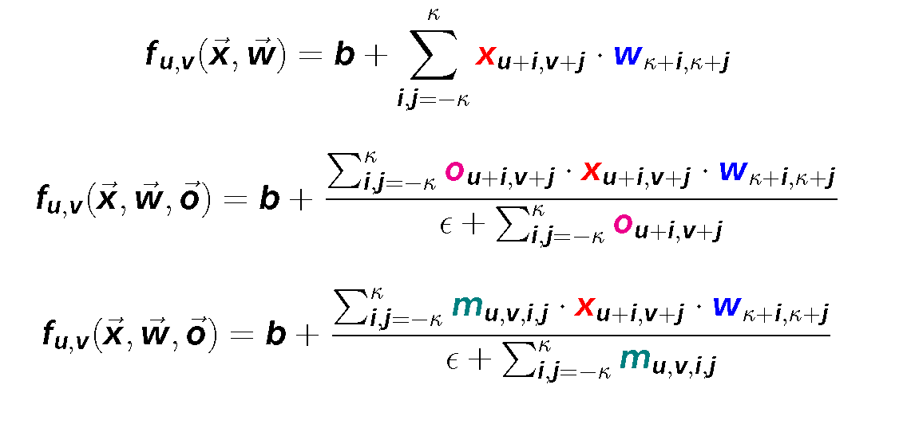
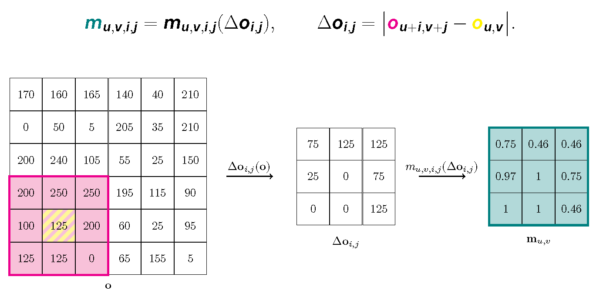

# Convolutional Neural Networks with Local Context Masks


This repository is the official implementation of [Convolutional Neural Networks with Local Context Masks].





## Environment

PyTorch 1.5.0

Python 3.7.2

CUDA 10.0.130


For comparison with Pixel-Adaptive Convolution, [pacnet](https://github.com/NVlabs/pacnet) must be cloned inside the repository.

## Training

The training framework is implemented for use within [RCI](rci.cvut.cz) cluster data storage. User must first edit data_loader/data_loaders.py and configuration files to begin training elsewhere.

To train the models using method described in the thesis, run this command:

```
python train.py -c <path_to_config> -r <path_to_model_checkpoint>
```

The code has been reorganized and model was changed since publishing the thesis. A ResNet-50 backbone was adapted for the method with a simple FCN segmentation head. This change allows direct comparison of Local Context Masked Convolution with Pixel-Adaptive Convolution, as the model no longer contains separable convolution.

To request access to the original models or the training framework implemented for [CMP](cmp.felk.cvut.cz) data storage, contact the author at paplhjak@fel.cvut.cz.

[CMP](cmp.felk.cvut.cz) users may browse the original framework, visualization and evaluation tools at /mnt/datagrid/personal/paplhjak/BThesis/.
